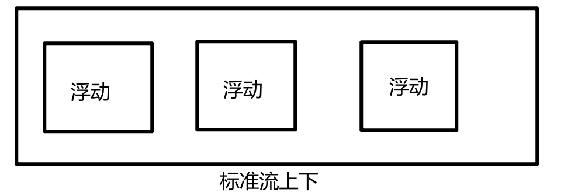

#CSS简单笔记
> css是层叠样式表的简称（样式表或级联样式表）

- CSS：css由选择器以及一条或者多条声明组成
- 语法规范：采用小写、展开式、空格等
- 选择器是用来选择标签的
  - 基础选择器：由单个选择器组成
    - 标签选择器、类选择器、id选择器和通配符选择器
  - 复合选择器：对基础选择器进行组合，由两个或多个基础选择器通过不提供的方式组成
    - 后代选择器、子选择器、并集选择器、伪类选择器
- 字体：类别、大小、粗细、样式（倾斜等）
- 引入方式：内部样式表、行内样式表、外部样式表
- **元素显示模式**就是元素（标签）以什么方式进行显示，比如`div`自己占一行，一行可以放多个span
  - 转换为行内块和快元素是用的最多的
  - HTML元素一般分为块元素和行内元素两种类型
  - **块元素**特点：
    1. 独占一行
    2. 高度、宽度、外边距以及内边距都可以控制
    3. 宽度默认是容器（父级宽度）的100%
    4. 是一个容器及盒子，里面可以放行内或者块级元素
    5. 文字类的元素内不能使用块级元素（p里面不能放div，同理h1到h6等）
  - **行内元素**（内联元素）特点：
    1. 相邻行内元素在一行上，一行可以显示多个
    2. 高、宽直接设置是无效的
    3. 默认宽度就是它本身内容的宽度
    4. 行内元素只能容纳文本或其他行内元素
    5. 链接里面不能放链接
    6. 链接里面可以放块级元素，但是给a转换一下块级模式最安全
  - **行内块元素**
    1. 和相邻行内元素（行内块）在一行上，但是他们之间会有空白缝隙，一行可以显示多个
    2. 默认宽度就是它本身内容宽度
    3. 高度、行高、外边距以及内边距都可以控制
    4. img\input\td
- 行高=上空隙+文字本身高度+下空隙，行高的上空隙和下空隙把文字挤到中间了，如果行高小于盒子高度，文字会偏上，如果行高大于盒子高度，则文字偏下
- 背景
  - 背景颜色，背景图片，背景平铺，背景图像固定等
  - 背景图片：实际开发常见于小logo或者一些，可以设置图片位置
  - 背景属性简写：背景颜色、背景图片地址、背景平铺、背景图像滚动、背景图片位置
- CSS三大特性
  - 层叠性：给相同的选择器多次设置样式，会采用就近原则进行覆盖
  - 继承性：字标签会继承父标签的某些样式，如文本颜色和字号，简化代码、降低样式的复杂性，text-，font-，line-这些元素开头的可以继承，但不是完全继承
  - 优先级:选择器相同，则执行层叠性。选择器不同，则根据选择器权重执行
  > 继承的权重是0，子元素得到的都是权重都是0
  > 符合选择器有权重叠加的问题
- 盒子模型
  - 页面布局三大核心：盒子模型、浮动和定位
  - 盒子模型：就是把HTML页面中的元素看做是一个矩形的盒子，也就是一个装内容的容器，css盒子模型本质上是一个盒子，封装周围的html元素，他包括：边框、外边距、内边距和实际内容
  - 盒子由四大部分组成：border、content、padding、margin
- 网页布局过程
  1. 先准备相关的网页元素，网页元素基本都是盒子box
  2. 利用css设置好盒子样式，然后摆放到相应位置
  3. 往盒子里装内容
- 外边距可以让盒子水平居中，但是盒子必须制定了宽度，盒子左右的外边距都设置为auto
- 行内元素和行内块元素水平居中可以给其父元素添加text-align:center即可
- 对于两个嵌套关系（父子关系）的块元素，父元素有上外边距同时子元素也有上外边距，此时父元素会塌陷较大的外边距值
  - 可以为父元素定义上边框
  - 可以为父元素定义上内边距
  - 可以为父元素添加overflow:hidden
- 行内元素为了照顾兼容性，尽量只设置左右内外边距 ，不要设置上下内外边距。但是转换为块级和行内块元素就可以了
- 圆角边框：正方形+半径等于边长一半可以实现圆
- 浮动
  - 传统网页布局的三种方式
    - 普通流/标准流：标签按照规定好的默认方式排列
    - 浮动
    - 定位
  - 浮动元素会脱离标准图通流的控制，浮动到指定位置
  - 浮动的盒子不再保留原先的位置
  - 任何元素都可以浮动，不管之前是什么模式的元素，添加浮动之后具有行内块元素相似的特性
  - 浮动元素会具有行内块元素特性
  - 如果行内元素有了浮动，则不需要转换块级、行内块元素就可以直接给高度和宽度
  - 如果块级盒子没有设置宽度，默认宽度和父级一样宽，但是添加浮动后，它的大小根据内容来决定
  - 浮动的盒子中间没有缝隙，是紧挨着一起的
  - 行内元素同理
  - 先用标准流的父元素排列上下位置，之后内部子元素采取浮动排列左右位置，符合网页布局第一准则
  - 
  - 网页布局第二准则：先设置盒子大小，之后设置盒子的位置
  - **<span style="color:red;font-size:20px;">浮动的盒子只会影响浮动盒子后面的标准流不会影响前面的标准流</span>**
  - 浮动清除：很多盒子不方便给高度
    - 清除浮动的额本质就是清除浮动元素造成的影响
    - 如果父盒子本身有高度，就不需要清除浮动
    - 清除浮动之后，父级就会根据浮动的子盒子自动检测高度。父级有了高度，就不会影响下面的标准流了
  - 清除浮动的策略是<em>闭合浮动</em>
    - 额外标签法
    - 父元素添加:overflow:hidden
    - 父级伪元素
      ```html
      .clearfix:after {
            content: "";
            display: block;
            height: 0;
            clear: both;
            visibility: hidden;
        }
        .clearfix {
            *zoom: 1;
        }
      ```
    - 父级双伪元素
      ```html
      .clearfix:before,
      .clearfix:after {
            content: "";
            display: table;
        }
      .clearfix:after {
            clear:both;
        }
      .clearfix {
            *zoom: 1;
        }      
      ```